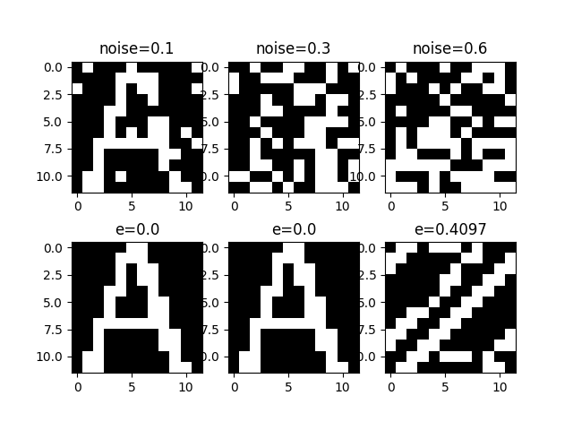
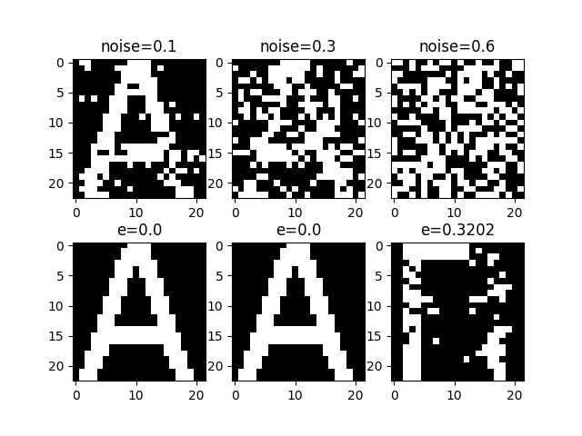
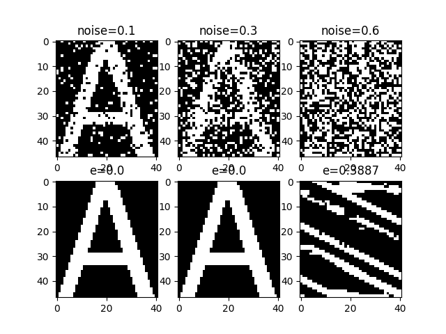

# English Alphabet Detection with Hopfield Neural Network

[about Hopfield Neural Network](https://en.wikipedia.org/wiki/Hopfield_network)

### Usage
- install requirements with ```pip install -r requirements.pip```
- run ```python generator.py``` to generate trian data
- run ```python main.py``` to test the hopfield neural network and result will be save in test_result directory

### Result
##### font = 16

##### font = 32

##### font = 64

